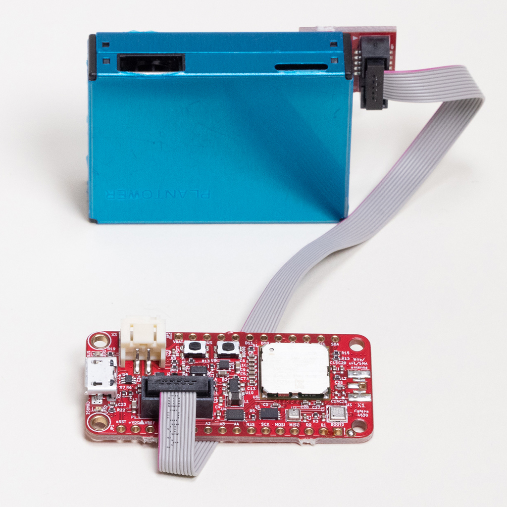
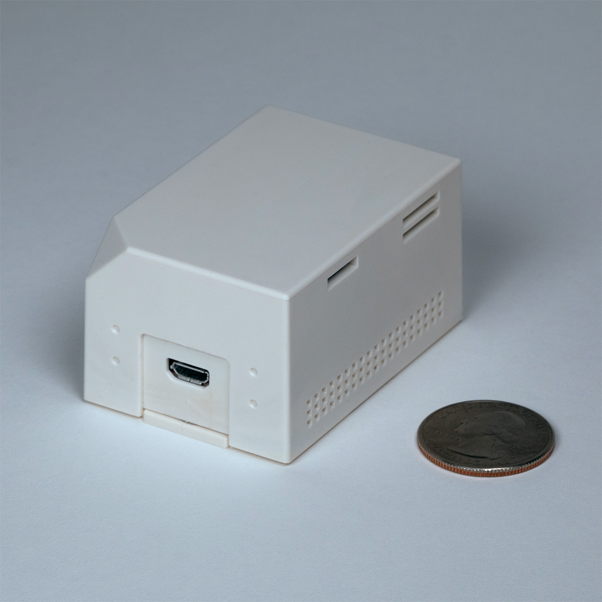

# MCCI PMS7003 Library

This library provides a structured interface to a Plantower PMS7003 particulate matter sensor. An example demonstrates the functionality of the PMS7003 with the MCCI Catena 4630 Air-Quality Sensor. This library is also used in the software for the MCCI [Model 4841 Air Quality Sensor](https://mcci.io/buy-model4841).

[](https://github.com/mcci-catena/MCCI-Catena-PMS7003/releases/latest) [](https://github.com/mcci-catena/MCCI-Catena-PMS7003/compare/v0.1.1...master) <!-- [](https://github.com/mcci-catena/MCCI-Catena-PMS7003/actions) -->

|        |         |        |
|--------|---------|--------|
| [](https://store.mcci.com/products/catena-4630 "Link to product page") | [](https://store.mcci.com/products/catena-4630 "Link to product page") | [](https://mcci.io/buy-model4841)

<!-- markdownlint-capture -->
<!-- markdownlint-disable -->
<!-- TOC depthFrom:2 updateOnSave:true -->

- [Introduction](#introduction)
- [Header Files](#header-files)
- [Library and Board Dependencies](#library-and-board-dependencies)
- [Namespace](#namespace)
- [Instance Objects](#instance-objects)
	- [HAL instance object](#hal-instance-object)
	- [cPMS7003 instance object](#cpms7003-instance-object)
- [Key classes](#key-classes)
	- [`cPMS7003Hal`](#cpms7003hal)
	- [`cPMS7003Hal_4630`](#cpms7003hal_4630)
	- [`cPMS7003`](#cpms7003)
	- [`cPMS7003::Measurements<>`](#cpms7003measurements)
- [Integration with Catena 4630](#integration-with-catena-4630)
- [Example Sketches](#example-sketches)
- [Additional code for dashboards](#additional-code-for-dashboards)
- [Useful references](#useful-references)
- [Board Support Dependencies](#board-support-dependencies)
- [Other Libraries and Versions Required](#other-libraries-and-versions-required)
- [Meta](#meta)
	- [Release History](#release-history)
	- [License](#license)
	- [Support Open Source Hardware and Software](#support-open-source-hardware-and-software)
	- [Trademarks](#trademarks)

<!-- /TOC -->
<!-- markdownlint-restore -->
<!-- Due to a bug in Markdown TOC, the table is formatted incorrectly if tab indentation is set other than 4. Due to another bug, this comment must be *after* the TOC entry. -->

## Introduction

The Plantower PMS7003 sensor is a laser-scattering-based particle concentration sensor. It returns two kinds of data:

- Particle concentrations for 1.0, 2.5 and 10 micron particles, expressed as &mu;g/m^3; and
- Dust concentrations for 0.3, 0.5, 1.0, 2.5, 5, and 10 micron particles, expressed as count/0.1 L of air.

Particle concentrations are expressed in terms of mass/volume; dust concentrations are expressed in terms of count/volume.

This library provides a framework for operating the PMS7003 in an Arduino environment.

Here's the basic UML class diagram.
<!--
see assets/cPMS7003.plantuml for source
-->
[](https://www.plantuml.com/plantuml/svg/PL5DRzD043rxViKebqgejbEAG4GzD3915CKbQkW98RHUJ-n5-s7jZeaiw7zd4rFgDgULP-PzlEVhmC9pRpJaPm2bgtjDYqHkoksx-VmowxImnoryxAravUm2airXU5-kqTEEF5b965pluxDp7X-nABK8WG90uRh1gwRbYDqIeP3IcKxOGTa6rpV5wdQxmftISSEGjCnTM2pol57SzbKMRtCZfKgbOB8YBuvFklHrhwnBencEiWPWsNFhVDJuIjuFM3hdwHpBehZ1mldEUN7mdtpkzO2lvnVl0MuTKvW6KaOq551Pl5ijom-hpDGeF653bYASQgm6x4JWWtDkLHXjAyiE4cu90_bVv54m7cB44Flz_d-9noYF7-SeR8sD5rKraX4adaAlZzptT-kG0Ppb0Asg2SbqFA0XKv4F05OO2fsGX6LiPcm4VuEe0diXUQmUvSPfBIfDNwgV91aU02RdMLP_YzmrsUzPDk7vz_kc8YVBg7KgDgu-2GqdanzltbxENum19WTuzITDJn4JlzcBDCyHpxXc5pEyIdNw2cTszdJo0DTawrZzNm00 "Click for SVG version")

`cPMS7003` is the class for instances of the PMS7003 sensor. As the diagram shows, it's a `cPollableObject`, so it will get polled along with everything else.

The class is intended to be portable; so instead of directly talking to hardware, it uses an associated HAL object and an abstract class `cPMS7003Hal`. The library supplies a concrete HAL implementation class, `cPMS7003Hal_4630`, which can be used on a Catena 4630.

## Header Files

- `<Catena-PM7003.h>` is the header file for the `cPMS7003` class.
- `<Catena-PMS7003Hal.h>` is the header file for the `cPMS7003Hal` class.
- `<Catena-PMS7003Hal-4630.h>` is the header file for the concrete HAL for the 4630, `cPMS7003Hal_4630`.

## Library and Board Dependencies

Because the main class `cPMS7003` uses `McciCatena::cPollableObject`, the Catena Arduino Platform must be available.

The example sketch targets the Catena 4630 and won't run on other hardware without modification.

## Namespace

The contents of the library are all in namespace `McciCatenaPMS7003`. We recommend you insert the following line after including the header files.

```c++
using namespace McciCatenaPMS7003;
```

## Instance Objects

To use this library, you must create two instance object.

### HAL instance object

You must create a HAL instance object to use this library. *Don't* try to instantiate an object of type `cPMS7003Hal`. It's an abstract class and can't be instantiated. Instead, instantiate an object from a concrete HAL class such as `cPMS7003Hal_4630`. The rules for instantiation are set by the concrete class; in this case, you need two arguments. The first argument is an lv that resolves to a `McciCatena::Catena4630` object. The second argument gives the initial value for the debug flags (see the [`debugmask` command](#debugmask)).

### cPMS7003 instance object

You must create a PMS7003 instance object. For example:

```c++
cPMS7003 gPms7003 { Serial2, gPmsHal };
```

## Key classes

### `cPMS7003Hal`

This is the abstract class which provides the HAL for the `cPMS7003` library. This is not modified for porting, unless we discover that it is insufficiently abstract.

### `cPMS7003Hal_4630`

This is the concrete HAL implementation for using the library on the Catena 4630. If porting to another platform, you will want to copy this (with a different name), and modify the method functions as appropriate.

### `cPMS7003`

This class models the low-level hardware of PMS7003 PM2.5 sensor. The class is partially abstract, in that it expects a wrapper class to provide virtual overrides for power control and the GPIOs. It uses the `cPollableObject` paradigm to drive accumulation of data from the sensor.

It models the device with an FSM shown in the next figure.

<!--
See source in assets/PMS7003_state.plantuml
-->
[![**FSM for PMS7003 low-level driver**](http://www.plantuml.com/plantuml/png/TLJVRzis47uM_ufxQe4rjfpjOPYn5WqS3-iGfu7jhi2MOM6aaqrC93N-Y6eiszy-YfALIna_YRhxxllkE_vuRnqtpikQxKM9WB9n1oZH5aOqJcZ5MFwQiPKkVOtpx6Qr-Nus--xFKEHmsjHSnLBsarT5XvwpxAOBVbfTWS4A3Qe2mMflmgVI1eg10IehfonZ2zqSZDZjNQZS808l2YqRhWv2xU3gms9vlLb29UgGSIpREzVO-JpFTyBj_VqqO7DP569IS8UAvulucLoOqWkb9w4L5qHbqBdmRgzD4DcYCGTOQMtm35QBnGTOQDDemxlsirzyVO1lP-S_C7Qj7LhgHqY-Gmj2mNfviRfSJcK9t23iK64ennBk3z1mwxhMtLxOlc-Xd6QPsoDOD0zeW3leV0GNRTkECunUZZzdm5K9EyFlxtioP9b1w-l8_MbzPQUClSuP-_sRFs0oUGVMVQmgnk9d2ApnRu_MtUWMpKS5Sy27p_mlPEobb7BcaCFM6mLQmQzbUQi0uic0yzbCMd12ee6qU1IpwAB6jWCoHa8zDxSM0vlfeeGS8ZSjYOnhhrIm-iG8ENIvk_LoizpUmLvCVlkwcKlT4Y_EcsW4T5MTfLPUgXq7IMHVlOB_gkKNuKuLX1ru3k_HBDwGqSS_B7lQgi_SIDymbXsNOzVHergXjV6elOKP0T7YA7cDxILtF8YIcX-3op3V7Dwy6OC9oRKsajUdITwz3IoXGO8a3TwDMq0XFVFFxQP6xFiRrWacHXUoZA2N8JVSMl606rJb4JY4WYHLITggTKiH4q-cDbw2M_LKS1uOIK-4KfLW8qaXIuevsY1MjrykjSAUwQXi8ggJ2pNa_cKqICNQ4FLHZM0I1rICpYdbQ_fa94ompmTzWZU8a_D2TwEFKEZf_QUWz00Cjog5qlvMoAqtuo27NtByNfw0YhauW0Jvp5hgFvKTY8iQkG7PPsG8djqgY7B7ODHBITAPa-lt-3Yy8TexbltBsF1o9EzhN2NPz1Ly2EzOO3q-H-z3VrxM_mC0)](https://www.plantuml.com/plantuml/svg/TLJVRzis47uM_ufxQe4rjfpjOPYn5WqS3-iGfu7jhi2MOM6aaqrC93N-Y6eiszy-YfALIna_YRhxxllkE_vuRnqtpikQxKM9WB9n1oZH5aOqJcZ5MFwQiPKkVOtpx6Qr-Nus--xFKEHmsjHSnLBsarT5XvwpxAOBVbfTWS4A3Qe2mMflmgVI1eg10IehfonZ2zqSZDZjNQZS808l2YqRhWv2xU3gms9vlLb29UgGSIpREzVO-JpFTyBj_VqqO7DP569IS8UAvulucLoOqWkb9w4L5qHbqBdmRgzD4DcYCGTOQMtm35QBnGTOQDDemxlsirzyVO1lP-S_C7Qj7LhgHqY-Gmj2mNfviRfSJcK9t23iK64ennBk3z1mwxhMtLxOlc-Xd6QPsoDOD0zeW3leV0GNRTkECunUZZzdm5K9EyFlxtioP9b1w-l8_MbzPQUClSuP-_sRFs0oUGVMVQmgnk9d2ApnRu_MtUWMpKS5Sy27p_mlPEobb7BcaCFM6mLQmQzbUQi0uic0yzbCMd12ee6qU1IpwAB6jWCoHa8zDxSM0vlfeeGS8ZSjYOnhhrIm-iG8ENIvk_LoizpUmLvCVlkwcKlT4Y_EcsW4T5MTfLPUgXq7IMHVlOB_gkKNuKuLX1ru3k_HBDwGqSS_B7lQgi_SIDymbXsNOzVHergXjV6elOKP0T7YA7cDxILtF8YIcX-3op3V7Dwy6OC9oRKsajUdITwz3IoXGO8a3TwDMq0XFVFFxQP6xFiRrWacHXUoZA2N8JVSMl606rJb4JY4WYHLITggTKiH4q-cDbw2M_LKS1uOIK-4KfLW8qaXIuevsY1MjrykjSAUwQXi8ggJ2pNa_cKqICNQ4FLHZM0I1rICpYdbQ_fa94ompmTzWZU8a_D2TwEFKEZf_QUWz00Cjog5qlvMoAqtuo27NtByNfw0YhauW0Jvp5hgFvKTY8iQkG7PPsG8djqgY7B7ODHBITAPa-lt-3Yy8TexbltBsF1o9EzhN2NPz1Ly2EzOO3q-H-z3VrxM_mC0 "Click for SVG version")

Features of this FSM:

1. The PMS7003 is initially powered down.
2. When a wake event is received from the application, the FSM powers up the PMS7003 and takes it through a wakeup sequence. Data received while in the warmup state is indicated up to the client, but tagged as warming up.
3. Once the library has finished the warmup sequence, it allows the client to operate the PMS7003 in "normal" mode (where the PMS7003 sends data spontaneously as it sees fit), or in "passive" mode (where the application must request a measurement).
4. At any time, the client may power down or reset the PMS7003.
5. While the PMS7003 is active, the client may select a low-power sleep mode, either via a hardware sleep (using the SET pin) or a software sleep (using a command).
6. Waking up the PMS7003 from sleep is the same as starting from power off; it must go through a warmup cycle. However, the timing for waking from sleep is much more deterministic. Starting from power off takes anywhere from 5 to 45 seconds (empirically determined); starting from sleep takes about 3 seconds to the first warmup message, and about 12 seconds to full operation.

### `cPMS7003::Measurements<>`

The PMS7003 sends three groups of measurements in each data set.

1. It sends atmospheric particulate matter concentrations binned by particle size: 1.0 micron, 2.5 micron and 10 micron particles. The units of measurement are &mu;grams per cubic meter of air.

2. It sends dust concentrations, also binned by particle size: 0.3, 0.5, 1.0, 2.5, 5 and 10 microns. The units of measurement are particle counts per deciliter of air.

3. It sends "factory" concentrations of particulate matter, binned by particle size as for atmospheric concentrations. These readings are typically only used for factory calibration and test.

The library defines structure templates for conveying this information. The template `cPMS7003::PmBins<typename NumericType>` represents the three bins in a single structure with fields `m1p0` for PM1.0 concentrations, `m2p5` for PM2.5 concentrations, and `m10` for PM10 concentrations. The library reports data using `cPMS7003::PmBins<std::uint16_t>`.

> If you are not familiar with templates, think of them as C++-aware macros. For example, the template for `PmBins<>` is:
>
> ```c++
> template <typename T>
> struct PmBins
>     {
>     T   m1p0;   // PM1.0 concentration ug/m3
>     T   m2p5;   // PM2.5 concentration ug/m3
>     T   m10;    // PM10 concentration ug/m3
>     };
> ```
>
> `T` is a parameter, which must be a type. When we write `PmBins<uint16_t>`, the compiler generates a structure by substituting `<uint16_t>` for `T`. So we get:
>
> ```c++
> struct
>     {
>     uint16_t    m1p0;   // PM1.0 concentration ug/m3
>     uint16_t    m2p5;   // PM2.5 concentration ug/m3
>     uint16_t    m10;    // PM10 concentration ug/m3
>     };
> ```
>
> We could do this with C preprocessor macros, but templates allow the compiler to understand what's intended, in a way that's not possible with C macros.

Two other templates are defined by the library. `cPMS7003::DustBins<>` similarly creates a structure representing the dust bins. The fields are named `m0p3`, `m0p5`, `m1p0`, `m2p5`, `m5`, and `m10`, corresponding to 0.3, 0.5, 1.0, 2.5, 5, and 10 micron particles.

The measurements (atmospheric, dust, and factory) are combined in a large structure, `cPMS7003::Measurements<>`. This contains the subfields `atm` and `cf1` (both `PmBins`), representing atmospheric and factory particulate matter measurements, and `dust` (an instance of `DustBins`).

Using templates, it's easy to generate a measurement structure using `float` or `uint32_t`; for each entry; just write `cPMS7003::Measurements<float>`,
`cPMS7003::Measurements<uint32_t>`, etc.

## Integration with Catena 4630

The Catena 4630 has the following features.

- LoRaWAN-compatible radio and software

- Bosch BME280 temperature/humidity/pressure sensor

- IDT ZMOD4410 gas sensor

- Interface to external Plantower PMS7003 particulate matter sensor, including 5V boost regulator and dedicated connector.

## Example Sketches

The `catena4630-pm7003-demo` example sketch allows interactive use of the PMS7003.

The `catena4630-pm7003-lora` example is a completely worked remote sensor sketch with power management.

## Additional code for dashboards

Check the [extras](./extras) directory for JavaScript code for calculating AQI, decoding data from LoRaWAN messages, and Node-RED and Grafana assets for presenting the data using the [`docker-ttn-dashboard`](https://github.com/mcci-catena/docker-ttn-dashboard).

## Useful references

The US laws defining PM2.5 can be found [here](https://www.law.cornell.edu/cfr/text/40/50.13).

See [acicn.org psm5003-7003](http://aqicn.org/sensor/pms5003-7003/) for some useful information and guidance on how to use the PMS7003 sensor for outdoor air quality measurements.

For information on converting PM2.5 and PM10 to AQI numbers, this website has good background: [How is the Air Quality Index AQI calculated?](https://stimulatedemissions.wordpress.com/2013/04/10/how-is-the-air-quality-index-aqi-calculated/).  However, many of the links in that article are broken. The US EPA site references are not current.

The reference info on calculating AQI is online in the EPA archives as [EPA-454/B-06-001, Guideline for Reporting of Daily Air Quality -- Air Quality Index (AQI)](https://archive.epa.gov/ttn/ozone/web/pdf/rg701.pdf). In July 2019, this was pretty hard to find, and it's not clear that the material will be available long term; so this library contains a copy, [rg701 accessed 2019-07-08](assets/rg701.pdf).

The PM2.5 calculations were revised in 2012. There is a good summary in the [aqicn.org "Revised PM2.5 AQI breakpoints"](http://aqicn.org/faq/2013-09-09/revised-pm25-aqi-breakpoints/) page. The links to EPA data there are broken, too.

The EPA data can be found in the Internet Archives [here](http://web.archive.org/web/20160326114514/https://www3.epa.gov/airquality/particlepollution/2012/decfsstandards.pdf); a copy is in this repo, [decfsstandards.pdf accessed 2019-07-22](assets/decfsstandards.pdf).

The relevant (and authoritative) rule from the [Federal Register](https://www.govinfo.gov/content/pkg/FR-2013-01-15/pdf/2012-30946.pdf) is also in this repo, [page 97, accessed 2019-07-22](assets/2012-30946-page97.pdf)

[Aqicn.org](http://aqicn.org) has real-time AQI data for reference from around the world. New York State provides real-time the AQI data for Rochester New York, available [here](http://aqicn.org/city/usa/newyork/rochester/).

## Board Support Dependencies

This library has been tested with MCCI's STM32L0 BSP v2.5.0 through v3.0.5 and the Catena 4630.

## Other Libraries and Versions Required

| Library | Recommended Version | Minimum Version | Comments |
|---------|:-------:|:----:|----------|
| [`Catena-Arduino-Platform`](https://github.com/mcci-catena/Catena-Arduino-Platform) | HEAD | 0.17.0.12 | HEAD has significant analog input improvements; 0.17.0.12 also has `cTimer`.
| [`arduino-lmic`](https://github.com/mcci-catena/arduino-lmic) | HEAD | 2.3.2 | Earlier versions will fail to compile due to missing `lmic_pinmap::rxtx_rx_polarity` and `lmic_pinmap::spi_freq` fields. Use of HEAD is strongly recommended as it has important improvements for LoRaWAN compliance. |
| [`arduino-lorawan`](https://github.com/mcci-catena/arduino-lorawan) | HEAD | 0.5.3.50 | Needed in order to support the Murata module used in the Catena 4551, and for bug fixes in LoRaWAN::begin handling. |
| [`catena-mcciadk`](https://github.com/mcci-catena/Catena-mcciadk) | 0.2.1 | 0.1.2 | Needed for miscellaneous definitions |
[`mcci-catena/MCCI_FRAM_I2C`](https://github.com/mcci-catena/MCCI_FRAM_I2C.git) | HEAD | needed by `Catena-Arduino-Platform` |

The example sketches use additional libraries.

| Library | Recommended Version | Minimum Version | Comments |
|---------|:-------:|:----:|----------|
| [`mcci-catena/Adafruit_BME280_Library`](https://github.com/mcci-catena/Adafruit_BME280_Library.git) | HEAD | `3dafbe1c1e9` | Has bug fixes from MCCI for proper operation. Needed for the RevA 4630 board.
| [`mcci-catena/Adafruit_Sensor`](https://github.com/mcci-catena/Adafruit_Sensor.git) | HEAD | 1.0.2 | MCCI version is just a snapshot for curation. Needed for the RevA 4630 board
| [`MCCI-Catena-SHT3x](https://github.com/mcci-catena/MCCI-Catena-SHT3x) | 0.2.0 | 0.2.0

## Meta

### Release History

- v0.1.1 is a patch release.

  - No changes to the library apart from version.
  - Updated the Javascript decoder for TTN v3 console ([#15](https://github.com/mcci-catena/MCCI-Catena-PMS7003/issues/15))

### License

This repository is released under the [MIT](./LICENSE) license. Commercial licenses are also available from MCCI Corporation.

### Support Open Source Hardware and Software

MCCI invests time and resources providing this open source code, please support MCCI and open-source hardware by purchasing products from MCCI, Adafruit and other open-source hardware/software vendors!

For information about MCCI's products, please visit [store.mcci.com](https://store.mcci.com/).

### Trademarks

MCCI and MCCI Catena are registered trademarks of MCCI Corporation. LoRaWAN is a registered trademark of the LoRa Alliance. LoRa is a registered trademark of Semtech Corporation. All other marks are the property of their respective owners.
